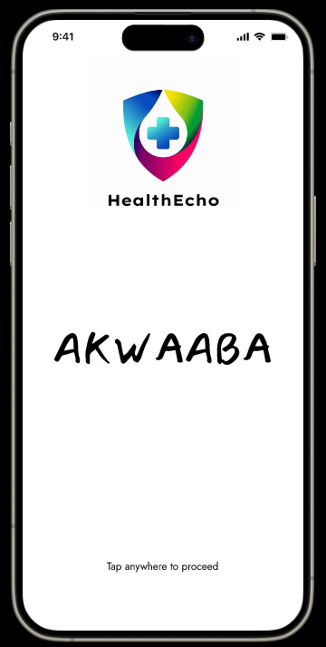
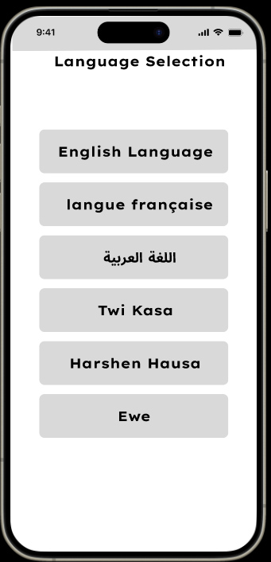
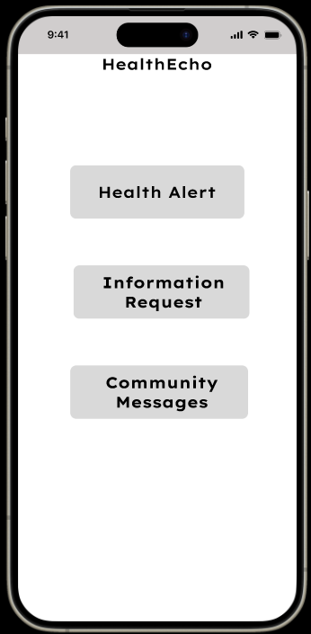
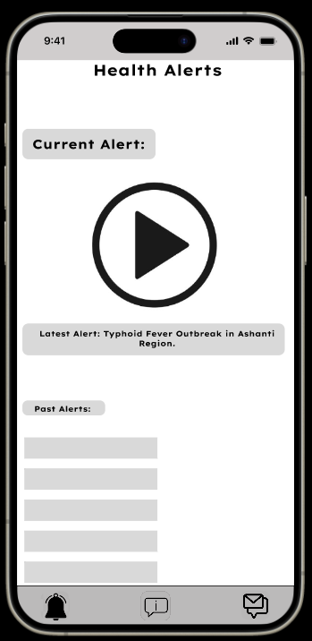
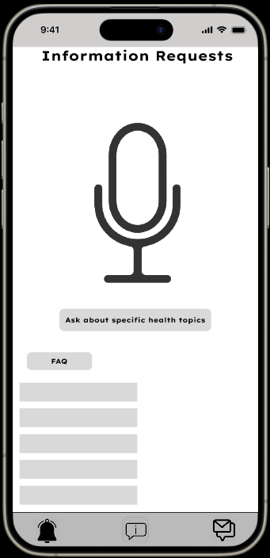
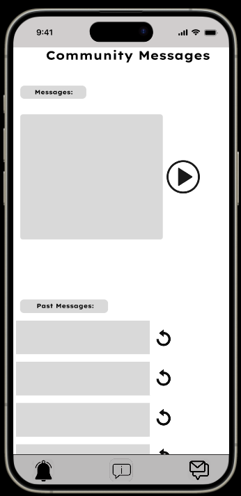

# HealthEcho UI/UX Design  
**Voice-Activated Health Alerts — Wireframes & Prototype**  

## Overview  
This repository contains **wireframes and design assets** for *HealthEcho*, a voice-first mobile app delivering critical health information in local languages. The UI prioritizes accessibility for low-literacy users through intuitive voice interaction and minimal text reliance.  

---

## Key Screens (Wireframes)  
### 1. **Welcome Screen**  
 
- **"Akwaaba"** (Welcome in Twi) with tap-to-proceed interaction.  
- Designed for instant engagement without instructions.  

### 2. **Language Selection**  

- Supports 6 languages:  
  - English, French, Arabic  
  - Twi, Hausa, Ewe  
- Voice-enabled selection (not shown in wireframe).  

### 3. **Main Menu**  
  
- 4 core options:  
  - **Health Alerts**  
  - **Information**  
  - **Request** (voice queries)  
  - **Community Messages**  

### 4. **Health Alerts Dashboard**  
  
- Highlights urgent outbreaks (e.g., *"Typhoid Fever in Ashanti Region"*).  
- Past alerts archive for reference.  

### 5. **Information Requests**  
  
- Voice-prompted health queries.  
- FAQ section for common topics.  

### 6. **Community Hub**  

- Shared messages from local health workers.  

---

## Design Principles  
1. **Zero-Text Default**  
   - Icons + voice replace buttons where possible.  
2. **Emergency-First Hierarchy**  
   - Alerts dominate the UI during outbreaks.  
3. **Cultural Localization**  
   - "Akwaaba" greeting, Twi/Hausa/Ewe support.  

---

## How to Use These Wireframes  
1. **View PDF**: [voice-activated-UI-wireframe.pdf](PDF/Voice activated UI wire-frame.pdf) 
2. **Figma Prototype**: [Interactive Prototype](https://www.figma.com/proto/J7pV2WOmktHEFC5hLfWiEn/Voice-activated-UI-wire-frame?node-id=0-1&t=b9NPD0eiP7EDczQm-1)  
3. **Assets**:  
   - `/wireframe` – PNG exports of each screen (ensure filenames match exactly).  
   - `/icons` – Culture-appropriate pictograms.  

